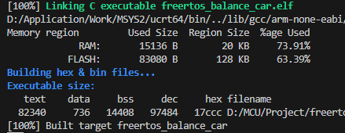

# 🚗FreeRTOS自平衡机器人：蓝牙遥控+自动跟随+安全保护+实时UI

本项目是一款基于 **STM32** 与 **FreeRTOS 实时操作系统** 开发的多功能自平衡机器人。
系统采用 **多任务调度、信号量同步与模块化软件架构**，实现稳定的平衡控制与环境感知，并提供直观的 **OLED 图形 UI 界面**。
支持 **蓝牙遥控、自动跟随、安全保护及多模式 UI 显示**，可在不同运行状态下实时展示控制信息与传感器数据。

---

## [📺 **演示视频**  ](https://www.bilibili.com/video/BV1vuPRzzEkq) | [🧩 **PCB工程**  ](https://oshwhub.com/fascinating_sea/stm32_balancecar)

---

# ✨ 系统功能

### 🤖 自平衡控制
- IMU 姿态解算
- 串级 PID 控制（角度环 + 速度环 + 转向环）

### 📡 蓝牙遥控
- UART 通信
- 实时控制小车运动方向与速度

### 📏 自动跟随
- 基于超声波测距
- 距离环 + 速度环控制

### 🛡 安全保护
- 倒地检测自动停机
- 着陆自动恢复平衡

---

# 📺 OLED UI 系统

系统基于 **u8g2 图形库** 实现实时 UI 显示。

提供 **三种运行模式界面**：

---

### 平衡模式 UI
- 左上角：当前模式
- 右上角：系统运行时间
- 中部：**Pitch 实时角度**
- 虚线：机械零点参考线

---

### 遥控模式 UI
- 左上角：当前模式  
- 右上角：实时测距距离  
- 中部：蓝牙连接状态  

底部 **避障条显示**  
- 障碍物越近，条形越短

---

### 跟随模式 UI
- 左上角：当前模式  
- 右上角：目标跟随距离  

中部 **雷达扫描图**

- 小圆点：目标位置  
- 根据距离变化动态移动

---

# 🧠 软件架构

系统基于 **FreeRTOS 多任务架构** 实现模块解耦，采用 **事件驱动控制模型**。

通过 **任务划分 + 二值信号量同步**，实现传感器数据与控制逻辑的高效协同。

---

## 任务调度策略

| 任务 | 优先级 | 运行周期 | 核心职责 |
|----|----|----|----|
| **Control Task** | 高 | 5ms | IMU姿态融合、三环PID控制、电机驱动 |
| **Detect Task** | 中 | 30ms | 模式切换、蓝牙通信、超声波测距、状态检测、异步测距 |
| **UI Task** | 低 | 180ms | OLED界面刷新、调试信息显示 |

---

## 🔗 二值信号量应用

项目使用 **二值信号量实现任务与中断同步**，将耗时逻辑从 ISR 中移出。

---

## UART 异步通信

流程：

1. 蓝牙数据触发 **USART RX 中断**
2. ISR 中仅释放信号量
3. Detect Task 获取信号量后解析数据

优势：

- 减少 ISR 执行时间
- 避免中断嵌套
- 实现 **零 CPU 忙等待**

---

## 超声波测距同步

流程：

1. 任务触发测距
2. Detect Task 调用 `osSemaphoreWait()` 阻塞
3. ECHO 中断触发释放信号量

---

## 蓝牙失联保护

系统通过 **心跳检测机制**：

- 记录 `last_rx_time`
- 周期检测通信状态
---

# 📊 系统资源占用

---

# 🖼 项目展示

### 整体结构

---

### UI 界面

**平衡模式**

**蓝牙遥控模式**

**自动跟随模式**

---

# ⚙️ 开发环境

- MCU：STM32F103C8T6  
- IDE：VScode + CubeMX + GCC + CMake + Ozone  
- RTOS：FreeRTOS  
- UI库：u8g2  

---

# 📦 物料清单
- [IN5824二极管*3(SS54 SMA) ￥2.18](https://e.tb.cn/h.6F2CfQNJmlFCtSV?tk=1M0LVkzgXYz ) 
- [塔克 R5 Pro系列两轮自平衡小车 ￥106](https://e.tb.cn/h.6uAF5g45EmSc1Lb?tk=GEIKVkA9akD) 
- [STM32F103C8T6最小系统板(进口-typec口) ￥9](https://e.tb.cn/h.6F2Kzzjs2VY6GzD?tk=upy0VkzbU8N) 
- [MPU6050陀螺仪(进口) ￥11](https://e.tb.cn/h.6F2REAKSzepmDb5?tk=JMgfVkBHsvY) 
- [0.96寸OLED显示屏(GND开头) ￥7](https://e.tb.cn/h.6FaghWoRMnjl6Zf?tk=mbYlVkz4WC8) 
- [HC-SR04测距模块 ￥3.1](https://e.tb.cn/h.6F29ufjsiZKU3F7?tk=2HK8VkBFq1j) 
- [Tb6612FNG电机驱动 ￥7.5](https://e.tb.cn/h.6F2A73fFesjWPn6?tk=6jn1VkziE4Q) 
- [有源蜂鸣器(低电平触发) ￥2.8](https://e.tb.cn/h.6F2PDBCUr0MiSKL?tk=fSuMVkBEkeY) 
- [3mm LED灯 ￥2.72]( https://e.tb.cn/h.6FahatjLZO8mKRz?tk=iPnXVkAzauR) 
- [按键(6 6 5mm直插) ￥2.1]( https://e.tb.cn/h.6uzuv80ohaMW2xr?tk=CVcmVkzlw2f ) 
- [0603贴片电容10uF(滤波) ￥2]( https://e.tb.cn/h.6uw25iNHxM6SlGP?tk=qVt0VkzE5cR ) 
- [SS12D10耐压开关(建议弯脚) ￥2](https://e.tb.cn/h.6uBBTqe01U2vcxu?tk=QgzGVkBKpRA) 
- [5.5*2.1DC插口(耐高温) ￥2.28]( https://e.tb.cn/h.6FaZAarcmwBMbPl?tk=mwa4VkBzccQ) 
- [DC-DC降压模块固定输出 5V ￥3.4](https://e.tb.cn/h.6FatQAOa1dSCjAw?tk=34RnVkzJe2M ) 
- [12V锂电池2500mAh(DC公母头) ￥22.6](https://e.tb.cn/h.6FaEa2BSxeb0pBQ?tk=a8VHVkztrz0) 
- [14p 18p 120p排母 ￥7](https://e.tb.cn/h.6FZKytSz8cwDzKC?tk=oqIVVkAIaMW) 
- [12p排针 ￥2.3]( https://e.tb.cn/h.6FZsiVNPa38YEo6?tk=emUCVkAHc1w )
