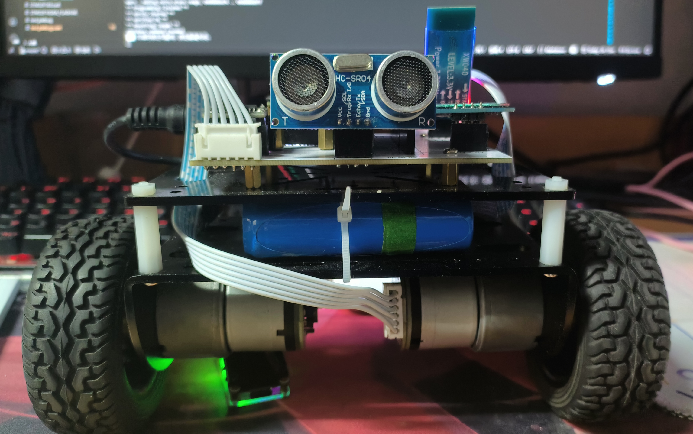
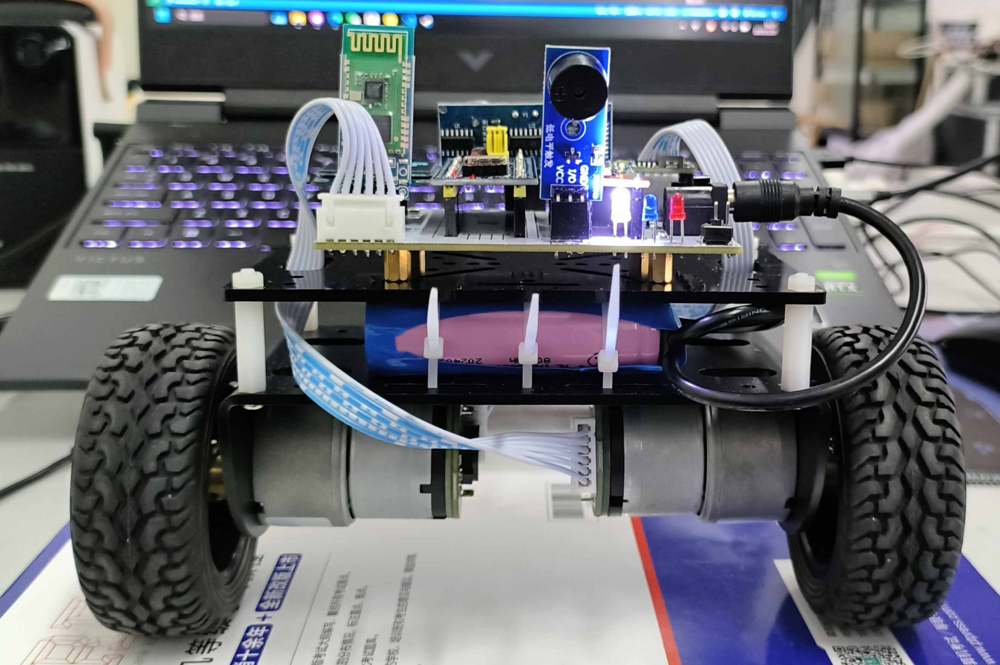
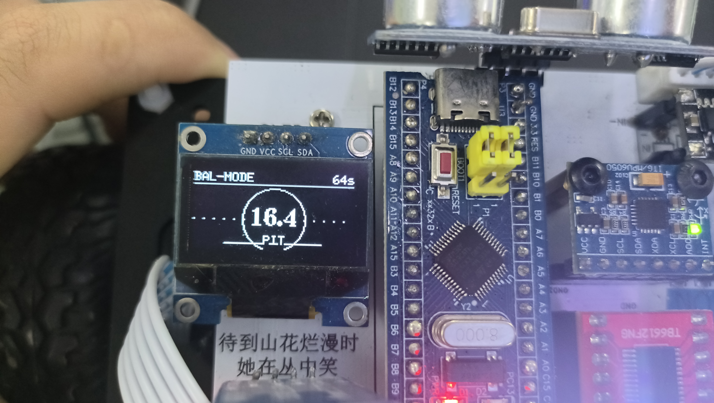
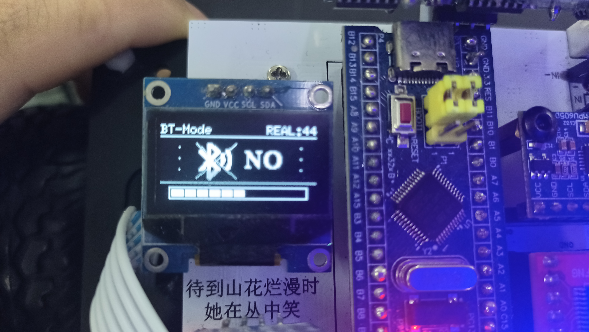
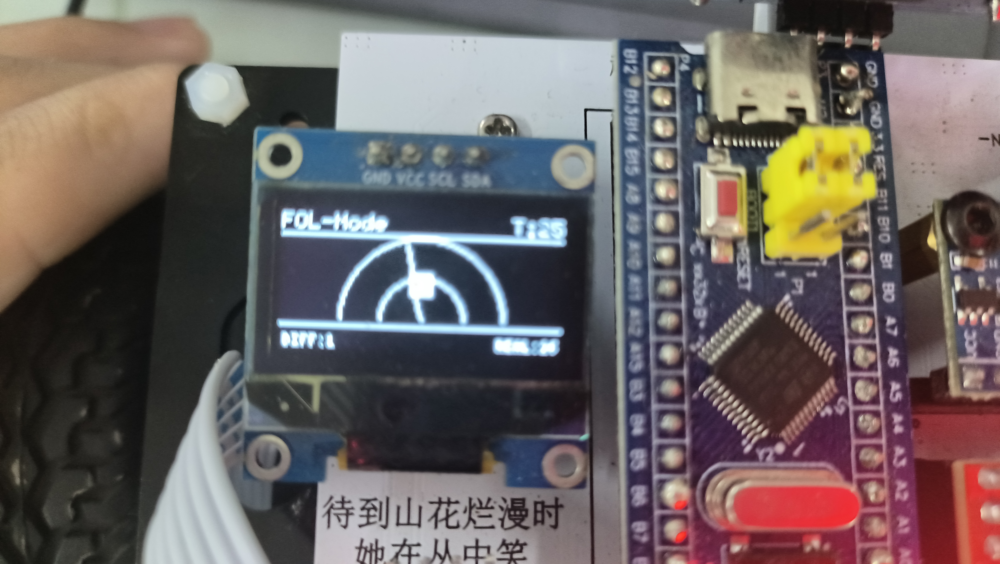

# STM32 + FreeRTOS 平衡车
## 本项目是一款基于 STM32 核心控制器与 FreeRTOS 实时操作系统开发的多功能双轮平衡小车。通过高效的任务调度与逻辑设计，实现了稳定的平衡控制、高精度的环境感知以及直观的 u8g2 UI 交互。
## [视频演示](https://www.bilibili.com/video/BV1s4JLzUE3u) | [PCB开源](https://oshwhub.com/fascinating_sea/stm32_balancecar)

## 🛠 核心架构：FreeRTOS 任务调度
项目通过 FreeRTOS 实现了控制、监测与显示的完全解耦，量化任务配置如下：
- **CtrlTask (最高优先级)** 负责 **MPU6050 角度解算**及**直立+速度+转向 PID **运算，确保平衡频率达 **200Hz**。

- **DetectTask (高优先级)**: 执行**模式切换**逻辑、**安全检测**及**超声波测距**。

- **OLEDTask (普通优先级)**：负责 **u8g2 UI** 渲染，采用**异步显示**机制，**不占用核心控制时序**。

### RTOS 技术深度应用
- **二值信号量 (Binary Semaphore)**：用于**蓝牙数据接收信号**``` (binSem_UART2Handle) ```及**超声波回响信号** ```(echoSemHandle)``` 的实时同步。

- **临界区保护 (Critical Sections)**：在修改 PID 目标值及切换模式时使用 ```taskENTER_CRITICAL()```，**防止多任务数据竞争**。

## 🎮 三大运行模式
系统支持通过**物理按键**循环切换，并动态更新 **PID** 参数：

| 模式名称 | 功能描述 | 核心量化指标 |
| :--- | :--- | :--- |
| **平衡模式** | 拥有稳健的自平衡能力，抗干扰鲁棒性强。 | 直立环采样率 **200Hz**，平衡倾角偏差 **< 0.5°**。 |
| **蓝牙遥控模式** | 通过 HC-06 模块与手机 App 连接，实现 8 方向遥控。 | 遥控响应延迟 **< 10ms**；具备 **7cm** 障碍物自动警报功能。 |
| **超声波跟随** | 小车自动保持与前方目标的距离。 | 跟随距离维持在约 **25cm**；测距精度达 **±0.1cm**。 |
## 3. 传感器技术：非阻塞式测距
超声波测距采用**信号量 + 定时器输入捕获 + 外部中断** 的组合方案：
- **高精度**：通过硬件定时器捕捉 ECHO 引脚的高电平持续时间。
- **实时性**：测量过程不阻塞 CPU 运行，测距数据通过滑动平均滤波处理，确保跟随模式下的平滑性。
## 📊 UI 交互设计 (**u8g2** 库)
项目基于 u8g2 图形库设计了三套独立 UI，通过 ```balance.mode``` 自动切换：
- **监控 UI**：实时显示 Pitch 角度、系统运行时间及当前工作状态。
- **蓝牙 UI**：显示连接状态 (OK/NO)。当接收到心跳包（包括 0x00）时立即显示连接成功。
- **雷达 UI**：模拟雷达扫描动画，量化显示前方障碍物的物理距离。
## 🛡 安全检测机制
系统内置双重安全防护，确保硬件安全：
- **倒地检测 (Detect_FallDown)**：当 $|Pitch| > 55^\circ$ 且持续 3 个周期时，判定为倒地，强制执行电机停机并锁定状态。
- **着陆检测 (Detect_PutDown)**：在锁定状态下，若满足“角度回正 (<10°)”、“角速度平静”且“轮子静止”持续 25 个周期 (约 0.75s) 时，自动重置 PID 积分并恢复平衡。
## 📺 演示与展示
- ### 概视图
 

- ### UI 界面



## 📦物料清单
- [IN5824二极管*3(SS54 SMA) ￥2.18](https://e.tb.cn/h.6F2CfQNJmlFCtSV?tk=1M0LVkzgXYz )
- [塔克 R5 Pro系列两轮自平衡小车 ￥106](https://e.tb.cn/h.6uAF5g45EmSc1Lb?tk=GEIKVkA9akD)
- [STM32F103C8T6最小系统板(进口-typec口) ￥9](https://e.tb.cn/h.6F2Kzzjs2VY6GzD?tk=upy0VkzbU8N)
- [MPU6050陀螺仪(进口) ￥11](https://e.tb.cn/h.6F2REAKSzepmDb5?tk=JMgfVkBHsvY)
- [0.96寸OLED显示屏(GND开头) ￥7](https://e.tb.cn/h.6FaghWoRMnjl6Zf?tk=mbYlVkz4WC8)
- [HC-SR04测距模块 ￥3.1](https://e.tb.cn/h.6F29ufjsiZKU3F7?tk=2HK8VkBFq1j)
- [Tb6612FNG电机驱动 ￥7.5](https://e.tb.cn/h.6F2A73fFesjWPn6?tk=6jn1VkziE4Q)
- [有源蜂鸣器(低电平触发) ￥2.8](https://e.tb.cn/h.6F2PDBCUr0MiSKL?tk=fSuMVkBEkeY)
- [3mm LED灯 ￥2.72]( https://e.tb.cn/h.6FahatjLZO8mKRz?tk=iPnXVkAzauR)
- [按键(6 6 5mm直插) ￥2.1]( https://e.tb.cn/h.6uzuv80ohaMW2xr?tk=CVcmVkzlw2f )
- [0603贴片电容10uF(滤波) ￥2]( https://e.tb.cn/h.6uw25iNHxM6SlGP?tk=qVt0VkzE5cR )
- [SS12D10耐压开关(建议弯脚) ￥2](https://e.tb.cn/h.6uBBTqe01U2vcxu?tk=QgzGVkBKpRA)
- [5.5*2.1DC插口(耐高温) ￥2.28]( https://e.tb.cn/h.6FaZAarcmwBMbPl?tk=mwa4VkBzccQ)
- [DC-DC降压模块固定输出 5V ￥3.4](https://e.tb.cn/h.6FatQAOa1dSCjAw?tk=34RnVkzJe2M )
- [12V锂电池2500mAh(DC公母头) ￥22.6](https://e.tb.cn/h.6FaEa2BSxeb0pBQ?tk=a8VHVkztrz0)
- [14p 18p 120p排母 ￥7](https://e.tb.cn/h.6FZKytSz8cwDzKC?tk=oqIVVkAIaMW)
- [12p排针 ￥2.3]( https://e.tb.cn/h.6FZsiVNPa38YEo6?tk=emUCVkAHc1w )


